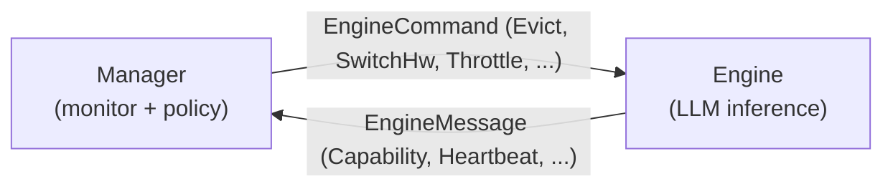

# Argus Manager

**System resource manager service** for the **Argus** on-device LLM inference
framework, written in Rust.

The manager runs as a separate process from the inference engine. It monitors system
resources (memory / CPU / GPU / temperature / power) and drives a scriptable policy
engine that sends `EngineCommand`s to the engine — evict KV cache, switch backend,
throttle, set the tensor-partition ratio, and so on — so inference adapts at runtime
under memory and thermal pressure.

This repository is the **manager**. It is one of three Argus repositories:

| Repo | Role |
|------|------|
| [`argus-engine`](https://github.com/hedone21/argus-engine) | LLM inference engine |
| [`argus-shared`](https://github.com/hedone21/argus-shared) | IPC protocol types (manager ↔ engine) |
| [`argus-manager`](https://github.com/hedone21/argus-manager) | System resource manager service (this repo) |



- **Transport:** Unix Domain Socket / TCP / D-Bus, serde JSON.
- **Policy:** a PI controller plus a scriptable policy engine (Lua via `mlua`).

## Features

| Feature | Default | Description |
|---------|---------|-------------|
| `dbus` | ✅ | D-Bus IPC transport (via `zbus`) |
| `lua` | ✅ | Lua-scripted policy engine (via `mlua`, vendored Lua 5.4) |
| `hierarchical` | | Hierarchical policy composition |

## Build & run

```bash
cargo build --release
cargo test --workspace

# Run the manager service (default transport: D-Bus; also accepts unix:/tcp:)
./target/release/argus-manager --transport unix:/tmp/argus_manager.sock

# Mock peers for integration testing without a real counterpart:
./target/release/mock_manager   # stands in for the manager (run when testing an engine)
./target/release/mock_engine    # stands in for the engine (run when testing the manager)
./target/release/sim_run        # policy simulation harness (requires the `lua` feature)
```

Example Lua policies live in [`scripts/`](scripts/) (`policy_default.lua`,
`policy_example.lua`); see [`policy_config.toml`](policy_config.toml) for configuration.

## License

Licensed under either of [Apache-2.0](LICENSE-APACHE) or [MIT](LICENSE-MIT) at your
option. Unless you state otherwise, contributions are dual licensed as above.
